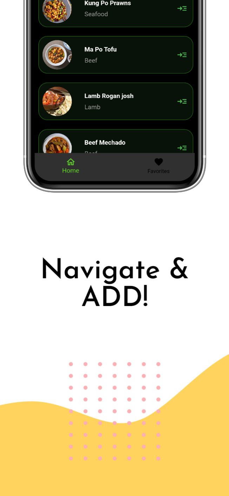
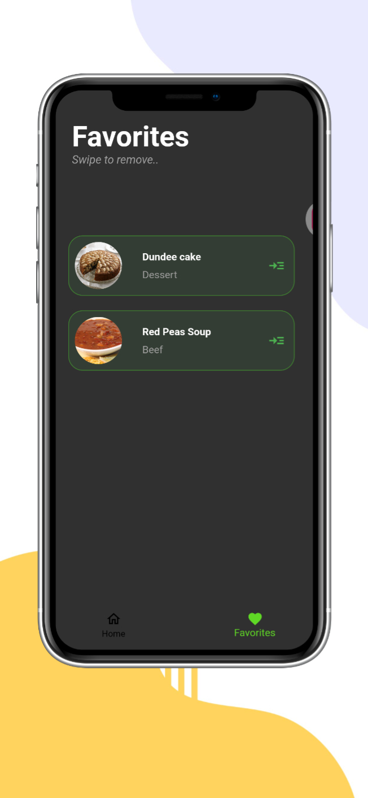

# FoodFinder

[](https://opensource.org/licenses/MIT)

## Overview

FoodFinder is a mobile application that allows users to discover and find their favorite dishes. Whether you're looking for a specific cuisine or just craving a particular dish, FoodFinder helps you locate the best places nearby.

## Features

- **Dish Search:** Easily search for your favorite dishes and discover nearby restaurants that serve them.
- **Cuisine Exploration:** Explore different cuisines and find the top-rated dishes in each category.
- **Favourites List:** Save the cuisines your like to your local storage.

## Installation

1. Clone the repository:

```bash
git clone https://github.com/Syf-Almjd/foodfinder.git
cd foodfinder
```

2. Install dependencies:

```
   flutter pub get
```


3. Run the application:

```
   flutter run
```


## Download the App

FoodFinder is available on [Google Play](https://play.google.com/store/apps/details?id=com.mjd.foodfinder). Download now and start exploring!

### Screenshots

| Screenshot 1                                   | Screenshot 2 | Screenshot 3 |
|------------------------------------------------|--------------|--------------|
|  |  |  |

| Screenshot 4 | Screenshot 5 | Screenshot 6 |
|--------------|--------------|--------------|
|  |  |  |


## Contributing

If you'd like to contribute to FoodFinder, please follow our [Contribution Guidelines](CONTRIBUTING.md).

## License

This project is licensed under the MIT License - see the [LICENSE](LICENSE) file for details.

## Acknowledgments

- Special thanks to [contributors](https://github.com/Syf-Almjd/foodfinder/graphs/contributors) who have helped make FoodFinder better!

